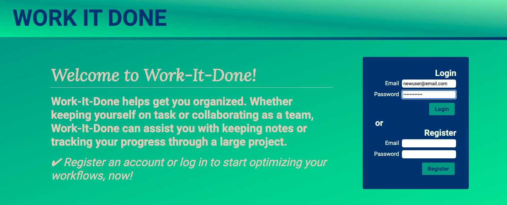
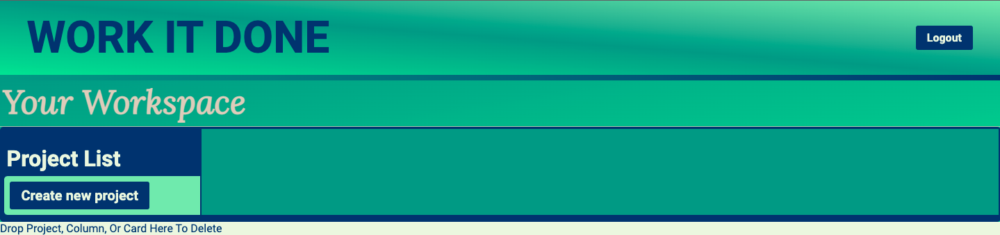
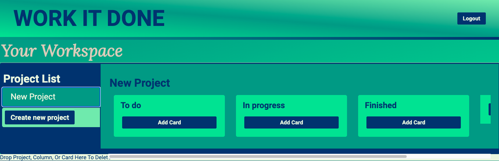

# WORK-IT-DONE

## Table of Contents 
* [Description](#description)
* [Instructions](#instructions)
* [Technologies Utilized](#technologies-utilized)
* [Contributions](#contributions)
* [Questions](#questions)
* [Future Features](#future-features)
* [Collaboration Requests](#collaboration-requests)

## Description

For our project we decided to make a project tracking website. 

Project Requirements:
 * Use Node and Express to create RESTful APIs.
 * Use Handlebars.js as the templating engine.
 * Use MySQL and the Sequelize ORM for the database.
 * Have both GET and POST routes for retrieving and adding new data.
 * Be deployed using Heroku (with data).
 * Use at least one new library, package, or technology that we haven’t discussed.
 * Have a polished UI.
 * Be responsive.
 * Be interactive (i.e., accept and respond to user input).
 * Have a folder structure that meets the MVC paradigm.
 * Include authentication (express-session and cookies).
 * Protect API keys and sensitive information with environment variables.
 * Have a clean repository that meets quality coding standards (file structure, naming conventions, best practices for class/id naming   conventions, indentation, quality comments, etc.).
 * Have a quality README (with unique name, description, technologies used, screenshot, and link to deployed application).


Based on the above requirements we decided to make a Trello-style kanban board. Each user is presented with a workspace where their projects can be stored. Within those projects, users can create status columns with moveable task cards. As the user progresses in completing tasks on a project, the user can move the task cards to reflect those changes - for example, from "To do" to "In progress" to "Finished".

**View the application, here:** [Work-it-Done](https://warm-eyrie-07140.herokuapp.com/ "Work-it-Done")

## Instructions 

| 1. New users can register with email/password | 2. Returning users can log in with the same email/password |
| :-- | :-- |
|  |  |

| 3. Create a new project | 4. View, add, or update columns and cards |
| :-- | :-- |
|  |  |

|5. Choose an existing project from the list | 6. View, add, or update columns and cards |
| :-- | :-- |
|  |  |

## Technologies Utilized
 
 * booststrap
 * MySQL
 * Handlebars
 * Node
 * Express
 * Sequelize
 * JQuery
 * JavaScript
 * HTML
 * CSS
 * node-input-validator

## Contributions

**Victor Weinert** 
- project management (role assignments, scheduling), schema design, initial seeds, routes, Heroku deployment, testing, bug fixes

**Patrick Sebstead** 
- RESTful API design (routes), README, testing, bug fixes

**TJ James**
- front end mock up, HTML, CSS, JS, Handlebars templates, bug fixes

**Lauren Groh** 
- ORM design (models & associations), README, PowerPoint slideshow, update seeds, styling & responsive design, testing, bug fixes

## Questions

If you have any questions, feel free to connect with us through Github: 

* [Victor Weinert](https://github.com/vw0389)
* [Patrick Sebstead](https://github.com/RaiderNationBuilder)
* [TJ James](https://github.com/jamestw13)
* [Lauren Groh](https://github.com/GrohTech)

## Future Features
1. Option to add multiple users per project
2. Google password syncing
3. Integrate other note taking apps
4. Implement states of tasks
5. Integrate weather apps to plan outdoor tasks
6. Implement automatic task movement from column to column

## Collaboration Requests

If you'd like to help implement any of these future features, please get in touch with one of [us](#contributions). 
To test out our project and come up with ideas to propose, follow the instructions, below:  

**Fork repository:**  
```
Click "Fork"
```

**Clone forked repository:**
```
git clone <repository link>
```

**Add npm dependencies:**
```
npm install
```
**Sign into MySQL:**
```
mysql -u root -p
```
**Import database:**
```
source db/schema.sql
```
**Exit MySQL:**
```
quit
```
**Seed database:**
```
npm run seed
```
**Create tables and start server:**
```
npm start
```
**Test Routes**
1. Go to RESTful API client
2. Test GET, POST, PUT, DELETE routes
3. Verify database has been updated in MySQL workbench